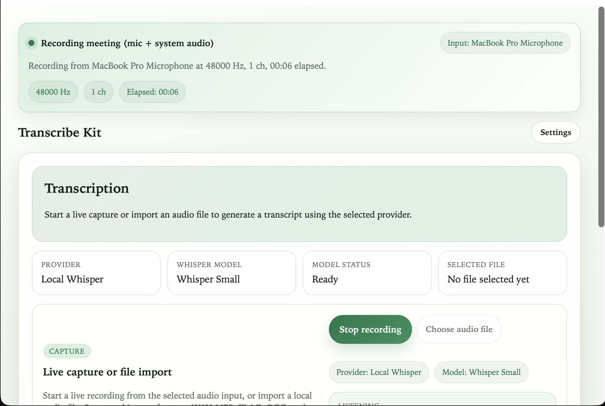
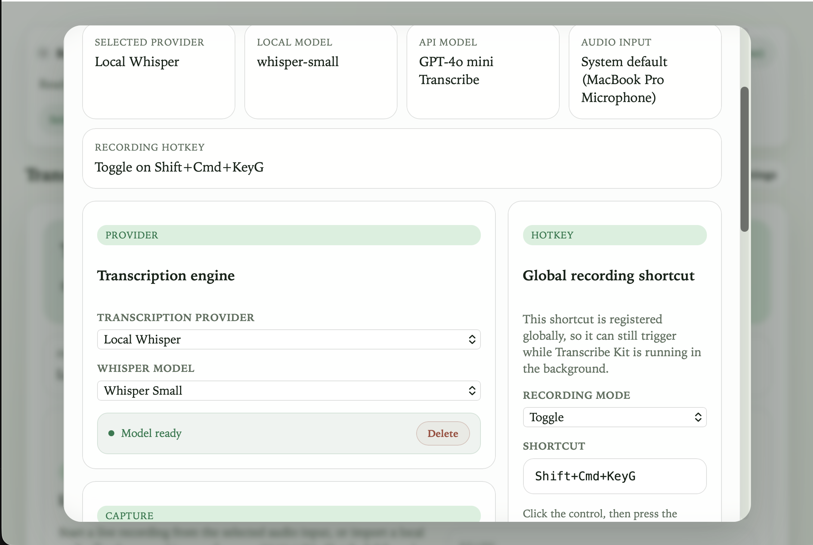
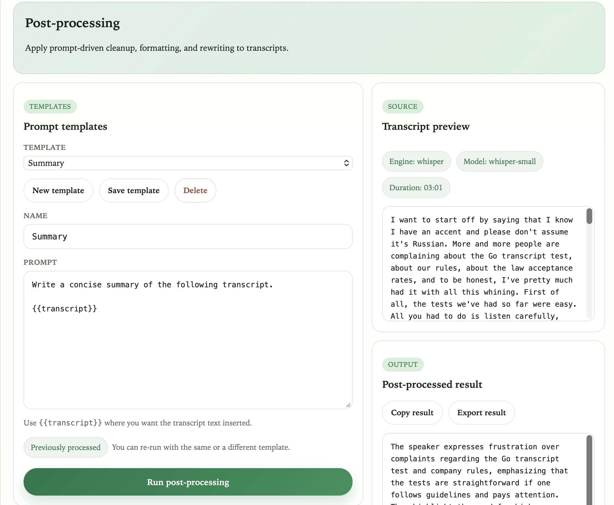

# Transcribe Kit

Cross-platform desktop transcription app built with Tauri + Leptos. Transcribe audio files or record live — using local Whisper models or any OpenAI-compatible API — then post-process results with AI prompt templates. One Rust codebase, all desktop platforms.

| Recording | Settings | Post-processing |
|:-:|:-:|:-:|
|  |  |  |

## Features

- **Local & API transcription** — run Whisper locally (tiny, base, small, large-v3-turbo) or hit any OpenAI-compatible endpoint. Automatic model download and caching for local mode.
- **File import** — drag in WAV, MP3, FLAC, OGG, or M4A files. Large files are auto-compressed to MP3 before API upload.
- **Live recording** — push-to-talk or toggle mode with a configurable global hotkey. Works even when the app is in the background.
- **Meeting capture** — dual-stream mode records microphone and system audio simultaneously, then mixes them into one file for transcription.
- **Real-time streaming** — transcription segments appear as they're produced, with progress updates.
- **Post-processing pipeline** — send transcripts through AI prompts. Ships with built-in templates (cleanup, meeting notes, summary) and supports custom user templates.
- **Secure API key storage** — credentials are stored in the system keyring, not in config files.
- **Persistent settings** — provider, model, device, hotkey, and API config auto-save with debouncing.
- **Cross-platform** — macOS, Windows, and Linux from one codebase.

## Tech Stack

| Layer | Technology |
|-------|-----------|
| Frontend | Leptos (Rust → WASM), bundled with Trunk |
| Desktop runtime | Tauri 2 |
| Local inference | whisper-rs (whisper.cpp bindings) |
| Audio I/O | CPAL for capture, Symphonia for decoding |
| API transport | reqwest with multipart streaming |
| Settings | JSON config + system keyring for secrets |

## Project Structure

```
frontend/src/         Leptos UI components and state
src-tauri/src/
  commands.rs         Tauri IPC command handlers
  transcription.rs    Transcription orchestration
  live_recording/     Audio capture and mixing
  providers/          Backend adapters (Whisper, OpenAI, Parakeet)
  settings.rs         Persistent config management
```

## Local Development

Prerequisites:

- Rust stable
- `wasm32-unknown-unknown` target
- `trunk`
- `tauri-cli`
- `cargo-make`
- `cmake` (required to build whisper.cpp from source)
- A C/C++ compiler (Xcode Command Line Tools on macOS, MSVC on Windows, `gcc`/`g++` on Linux)
- Platform dependencies required by Tauri

Commands:

```bash
cargo install cargo-make --locked
cargo make setup
cargo make dev
```

Production build:

```bash
cargo make build
```

Useful task shortcuts:

- `cargo make setup`: install the WASM target plus required CLI tools
- `cargo make dev`: run the Tauri desktop app in development mode
- `cargo make build`: build production desktop bundles
- `cargo make build-frontend`: build the Leptos frontend only

## Why Leptos Here

This repo is intentionally Rust-first to reduce future JavaScript ecosystem maintenance. The UI is simple enough that Leptos and Trunk are a good fit, while native-heavy behavior like audio capture, hotkeys, settings persistence, and local model orchestration still live in Tauri.
